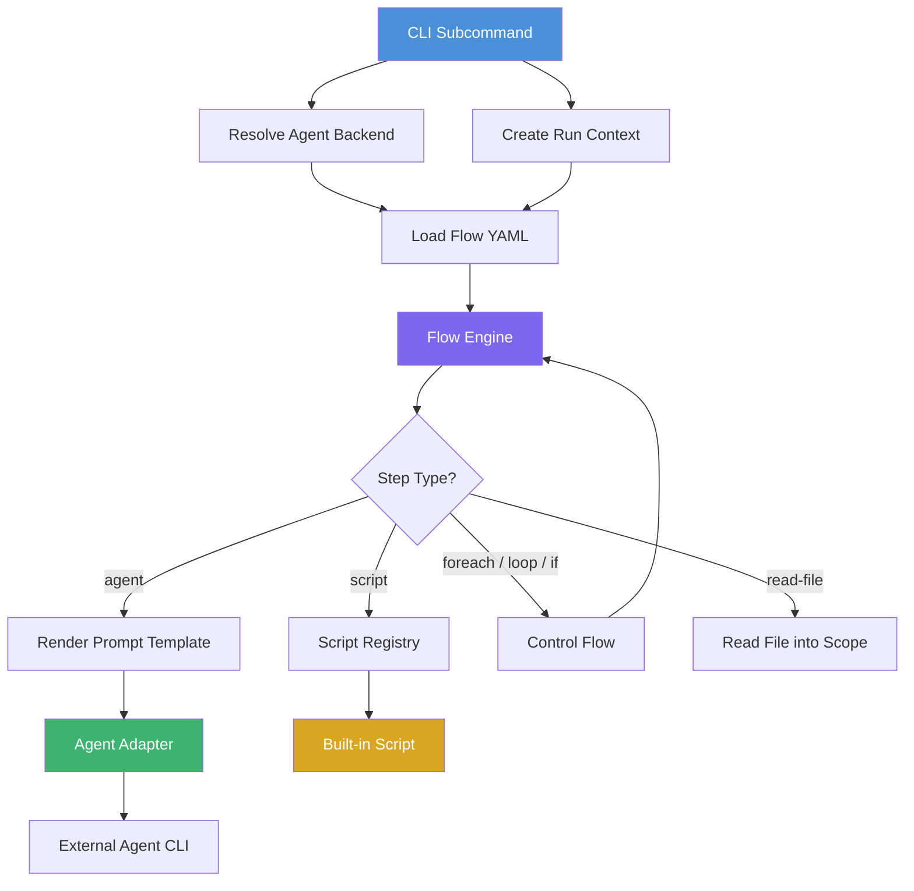

# Architecture — Saaga

`saaga` is a CLI tool that orchestrates AI coding agents (Cursor, GitHub Copilot, Claude) to generate and maintain domain documentation for software projects. It executes declarative YAML workflows that combine agent invocations, built-in scripts, and control-flow primitives.

## Overall Architecture

The system is structured as a pipeline:

```
CLI (commander) → Backend/Agent resolution → Flow loading → Flow engine execution
```

1. The **CLI** parses subcommands and global flags, resolves the agent backend, and creates a run context (unique ID + output directory).
2. The **Flow Loader** reads the YAML flow file for the chosen subcommand.
3. The **Flow Engine** executes each step sequentially. Steps can invoke an agent with a rendered prompt, call a built-in script, or use control-flow primitives (`foreach`, `loop`, `if`, `read-file`).
4. **Agent adapters** shell out to external CLI tools (`cursor-agent`, `copilot`, `claude`) to perform AI-driven work.
5. **Built-in scripts** handle structured data operations (plan parsing, change detection, baseline generation, rule installation) that are better expressed in code than in agent prompts.

### Data Flow



### Key Design Decisions

- **Declarative orchestration**: Workflow logic lives in YAML flow files, not application code. Adding or reordering steps requires no code changes.
- **Agent-agnostic**: The `Agent` interface abstracts over backends. The engine never references a specific agent implementation.
- **Scope-based data flow**: All inter-step communication flows through a mutable scope dictionary. Steps read from and write to scope variables using `${var}` expressions.
- **Run isolation**: Each invocation gets a unique run directory under `$SAAGA_DIR/runs/<run-id>/` for plans, reviews, and status files.
- **No git dependency**: File manifests, hashing, and change detection are implemented in pure Node.js. No git CLI is required at runtime.

## Modules

### CLI (`src/cli.ts`)

Entry point. Defines five subcommands (`init`, `install-rules`, `update`, `quick-update`, `verify-quick-updates`) using `commander`. Four of these resolve the agent, create a run context, load the corresponding flow, and call the engine. The `install-rules` subcommand is standalone: it runs the rule installer directly without an agent backend.

**Exports**: `runCli(argv, options): Promise<number>`, `CliOptions`

**Dependencies**: `cli/config`, `cli/backend`, `engine/loader`, `engine/runner`, `run-context`, `logger`, `paths`, `scripts/install-rules`

### Config (`src/cli/config.ts`)

Loads and validates project-level configuration from `.saaga/config.yaml`. Returns an empty config object when the file does not exist, enabling zero-config usage. Throws `ConfigError` on malformed YAML or invalid field types.

**Exports**: `loadConfig(projectDir): Promise<SaagaConfig>`, `SaagaConfig` interface, `ConfigError` class, `CONFIG_DIR` (constant: `".saaga"`), `CONFIG_FILE` (constant: `"config.yaml"`)

**`SaagaConfig` fields**: `backend?: string`, `model?: string`, `quickModel?: string`, `ruleTargets?: string`

**Dependencies**: `yaml` (npm package)

### Backend (`src/cli/backend.ts`)

Resolves which agent backend to use and constructs the concrete `Agent` instance.

**Exports**: `resolveBackend(input): Backend`, `defaultModelFor(backend): string`, `defaultQuickModelFor(backend): string`, `createAgent(opts): Agent`, `Backend` type, `BackendError`, `ResolveBackendInput`, `CreateAgentOptions`

**Resolution precedence**: `--backend` flag → `.saaga/config.yaml` `backend` field → error.

`ResolveBackendInput` carries `flag?: string` (from CLI `--backend`) and `config?: string` (from `.saaga/config.yaml` `backend` field).

**Dependencies**: `agent/copilot-agent`, `agent/cursor-agent`, `agent/claude-agent`, `agent/types`

### Agent (`src/agent/`)

Defines the `Agent` interface and its implementations. Each adapter shells out to an external CLI binary.

#### Interface (`src/agent/types.ts`)

```typescript
interface Agent {
  name: string;
  run(prompt: string, opts: AgentRunOpts): Promise<AgentRunResult>;
}
```

`AgentRunOpts` carries `cwd` and an optional `AbortSignal`. `AgentRunResult` carries `exitCode`.

#### CursorAgent (`src/agent/cursor-agent.ts`)

Invokes `cursor-agent --print --force --model <model>`. In CI mode, adds `--output-format text`. Passes `stdio: "inherit"` to `execa`, so agent child-process stdout/stderr is visible in the parent terminal.

#### CopilotAgent (`src/agent/copilot-agent.ts`)

Invokes `copilot -p <prompt> --allow-all-tools --no-ask-user --model <model> --no-auto-update`. Temporarily renames `.gitignore` to `.gitignore.<random-hex>.bak` before invocation (Copilot's indexer respects `.gitignore`, which can hide files needed during documentation runs). The random suffix (8 hex characters from `randomBytes(4)`) prevents collisions between concurrent agent runs in the same directory. Passes `stdio: "inherit"` to `execa`, so agent child-process stdout/stderr is visible in the parent terminal.

#### ClaudeAgent (`src/agent/claude-agent.ts`)

Invokes `claude --print --dangerously-skip-permissions --model <model>`. The `ci` field is stored in the constructor but is not currently used in CLI argument construction (unlike `CursorAgent` which adds `--output-format text` in CI mode). Passes `stdio: "inherit"` to `execa`, so agent child-process stdout/stderr is visible in the parent terminal.

#### FakeAgent (`src/agent/fake-agent.ts`)

Test double. Returns canned results keyed by substring match against the prompt. Records all calls for assertion. Supports optional side-effect callbacks to simulate file writes.

### Engine (`src/engine/`)

The flow execution engine. Loads YAML flow definitions, evaluates expressions, and dispatches steps.

#### Types (`src/engine/types.ts`)

Defines the flow DSL type system:

| Type | Fields |
|------|--------|
| `FlowDefinition` | `name`, `steps: Step[]` |
| `AgentStep` | `prompt`, `vars?`, `expect_file?` |
| `ScriptStep` | `name`, `args`, `set?` |
| `ForeachStep` | `var`, `in`, `when?`, `do: Step[]` |
| `LoopStep` | `max`, `until`, `do: Step[]` |
| `IfStep` | `condition`, `then: Step[]` |
| `ReadFileStep` | `path`, `set`, `trim?` |

`Step` is the discriminated union of all step types. `Scope` is `Record<string, unknown>`.

#### Loader (`src/engine/loader.ts`)

Reads a `.flow.yaml` file from the `flows/` directory, parses YAML, and validates the structure into a `FlowDefinition`.

**Exports**: `loadFlow(name): Promise<FlowDefinition>`, `loadFlowFromFile(path)`, `parseFlowDefinition(raw)`

#### Runner (`src/engine/runner.ts`)

Executes a `FlowDefinition` by iterating its steps. Dispatches each step by type to the appropriate primitive handler. For `agent` steps: renders the prompt template, invokes `Agent.run()`, and optionally asserts that an expected output file exists. Produces structured log output with timing and step positioning when a `Logger` is provided.

**Exports**: `runFlow(flow, initialScope, deps)`, `RunFlowDeps`, `AgentStepFailedError`, `ExpectFileMissingError`

`RunFlowDeps` bundles the `Agent`, working directory, optional script registry override, and an optional `logger?: Logger`. When `logger` is omitted, a silent logger (no-op stream) is used so library callers and tests don't get noise.

#### Expression (`src/engine/expression.ts`)

Handles `${var}` interpolation and predicate evaluation used by `when:`, `until:`, and `if:` clauses.

**Exports**:
- `interpolate(template, scope): string` — replaces `${var.field}` references with string-coerced scope values.
- `resolveValue(expr, scope): unknown` — like `interpolate`, but preserves raw types for sole-reference expressions (needed for `foreach.in` to receive arrays).
- `evaluatePredicate(expr, scope): boolean` — supports `==`, `!=`, `<`, `>`, `<=`, `>=` operators and bare truthy checks.

#### Primitives (`src/engine/primitives/`)

Each control-flow step type has a dedicated handler. All receive a `StepDispatcher` callback to recurse into child steps, avoiding circular imports with the runner.

| Primitive | Behavior |
|-----------|----------|
| `foreach` | Resolves `in` to an array, binds each item to `var` in scope, optionally filters with `when`, executes `do` body. Restores previous scope binding on completion. |
| `loop` | Runs `do` body up to `max` times. Sets `${iteration}` (1-indexed). Exits early when `until` predicate is true. |
| `if` | Executes `then` body when `condition` is true. No `else` branch. |
| `read-file` | Reads a file (path supports `${...}` interpolation) and binds UTF-8 content to a scope variable. Optional `trim`. |
| `script` | Looks up a handler in the script registry, interpolates args, calls it, and optionally binds the return value to a scope variable. |

### Scripts (`src/scripts/`)

Built-in script handlers invoked by `script` steps. Registered in a `ScriptRegistry` map.

#### Registry (`src/scripts/registry.ts`)

**Exports**: `defaultScriptRegistry: ScriptRegistry`, `ScriptHandler` type, `ScriptContext` type

The default registry maps: `"parse-plan"` → `parsePlan`, `"detect-changes"` → `detectChanges`, `"generate-baseline"` → `generateBaseline`, `"archive-quick-update"` → `archiveQuickUpdate`, `"collect-quick-updates"` → `collectQuickUpdates`, `"remove-quick-updates"` → `removeQuickUpdates`, `"install-rules"` → `installRules`.

#### parse-plan (`src/scripts/parse-plan.ts`)

Reads a plan file, extracts YAML frontmatter, and returns `Phase[]` (each with `number` and `title`). Used by `init`, `update`, and `verify-quick-updates` flows to drive the `foreach` loop over phases.

#### detect-changes (`src/scripts/detect-changes.ts`)

Compares the current work tree against `<app>/docs/BASELINE`. Classifies differences as: changed, new, truly deleted, newly ignored. Writes a markdown report to `<output_dir>/changes.md` and returns counts. The `update` and `quick-update` flows use `${changes.count}` to skip work when nothing changed.

#### generate-baseline (`src/scripts/generate-baseline.ts`)

Writes `<app>/docs/BASELINE` containing a `# Generated:` timestamp header and one `<hash> <path>` line per in-scope file, excluding `docs/`, `.saagaignore`, `.git/`, and any path matched by `.gitignore`/`.saagaignore` patterns. Hashes are computed locally without git CLI.

#### file-manifest (`src/scripts/file-manifest.ts`)

Shared utility used by `detect-changes` and `generate-baseline`. Recursively walks an application directory, honoring nested `.gitignore` and `.saagaignore` files at every directory level with "deepest match wins" semantics (via the `ignore` npm package). Returns a sorted `FileEntry[]` with SHA-1 git blob hashes computed locally. No git CLI required.

Symlinks are included as manifest entries and hashed git-style (hash of the link target path string, not the linked file's content). Symlinked directories are not traversed.

**Exports**: `computeManifest()`, `gitBlobHash()`, `fileExists()`, `FileEntry`

#### archive-quick-update (`src/scripts/archive-quick-update.ts`)

Copies the detect-changes report into the quick-update metadata folder. Validates that a `summary_path` (if provided) exists on disk before archiving, preventing incomplete artifacts.

**Exports**: `archiveQuickUpdate()`, `ArchiveQuickUpdateArgs`

#### collect-quick-updates (`src/scripts/collect-quick-updates.ts`)

Snapshots all quick-update metadata folders and writes a JSON manifest listing their IDs. Used by `verify-quick-updates` to capture the set of artifacts to process.

**Exports**: `collectQuickUpdates()`, `CollectQuickUpdatesArgs`, `CollectQuickUpdatesResult`

#### remove-quick-updates (`src/scripts/remove-quick-updates.ts`)

Deletes exactly the quick-update metadata folders listed in a manifest. Folders created after the snapshot are preserved. Includes path-traversal defense.

**Exports**: `removeQuickUpdates()`, `RemoveQuickUpdatesArgs`

#### install-rules (`src/scripts/install-rules.ts`)

Installs always-on documentation rule stubs into an application directory. Supports four rule targets (`agentsmd`, `cursor`, `claude`, `copilot`) plus `none`. Shared-file targets (`agentsmd`, `claude`) use managed-block upsert between `<!-- saaga:begin/end -->` markers. Owned-file targets (`cursor`, `copilot`) overwrite the file using a wrapper template from `rules/`.

**Exports**: `installRules()`, `parseRuleTargets()`, `InstallRulesArgs`, `RULE_TARGETS`, `RuleTarget`, `MANAGED_BLOCK_BEGIN`, `MANAGED_BLOCK_END`

### Templates (`src/templates.ts`)

Renders prompt files by substituting `{key}` placeholders with provided variables.

**Exports**: `renderPrompt(template, vars, options): string`, `renderPromptFile(path, vars, options): Promise<string>`, `MissingTemplateVariableError`, `TemplateFileNotFoundError`

Unmatched placeholders are left intact by default (prompts use `{Type}` as literal documentation). Strict mode is available for testing.

### Run Context (`src/run-context.ts`)

Generates a unique run ID and creates the run output directory. Also provides a `date` field (formatted as YYYYMMDD) for use in date-stamped output filenames.

**Exports**: `createRunContext(input): Promise<RunContext>`, `RunContext`, `CreateRunContextInput`

**ID format**: `<app>-<subcommand>-<YYYYMMDD>-<HHMMSS>-<8 hex chars>`

**Directory**: `$SAAGA_DIR/runs/<run-id>/` (defaults to `$HOME/.saaga/runs/`)

### Paths (`src/paths.ts`)

Resolves package-root-relative directory constants.

**Exports**: `PACKAGE_ROOT`, `FLOWS_DIR`, `PROMPTS_DIR`, `RULES_DIR`

Works identically whether running from `src/` (via `tsx`) or `dist/` (compiled).

### Logger (`src/logger.ts`)

Structured leveled logger (`info`, `warn`, `error`) with hierarchical indentation support for nested flow primitives. In CI mode, outputs plain `[LEVEL]` tags. In interactive mode, uses ANSI colors via `picocolors`. Every line is prefixed with `[LEVEL]` followed by indentation padding (controlled by the `indent` option).

**Exports**: `Logger` class, `LoggerOptions`

`LoggerOptions` fields: `ci?: boolean` (plain text mode, default `false`), `stream?: NodeJS.WritableStream` (output target, default `process.stderr`), `indent?: number` (spaces prepended after the level tag, default `0`).

`Logger.child(extraIndent = 2)` returns a new `Logger` that shares the same stream and CI setting but indents every line by `extraIndent` additional spaces. Used by the runner to nest log output inside `foreach` and `loop` iterations.

### Flow Definitions (`flows/`)

YAML files that define the step sequence for each subcommand. The engine loads them by name.

| Flow | Subcommand | Steps |
|------|------------|-------|
| `init.flow.yaml` | `init` | Architecture → plan → phase-0 slice → install-rules → foreach phase (slice + verify/fix loop) → generate baseline. |
| `update.flow.yaml` | `update` | Detect changes → if changes exist: plan → foreach phase (slice + verify/fix loop) → regenerate baseline. |
| `quick-update.flow.yaml` | `quick-update` | Detect changes → if changes exist: agent quick-update → read status → if UPDATED: archive-quick-update → generate baseline. |
| `verify-quick-updates.flow.yaml` | `verify-quick-updates` | Collect quick-updates → if any: plan → foreach phase (slice + verify/fix loop) → remove processed artifacts. |

### Prompt Templates (`prompts/`)

Markdown files with `{var}` placeholders, rendered by the templates module before being passed to an agent.

| Template | Purpose |
|----------|---------|
| `document-architecture.md` | Generate architecture documentation |
| `plan-init.md` | Create initial documentation plan |
| `plan-update.md` | Create incremental update plan from change report |
| `plan-verify-quick-updates.md` | Create verification plan from accumulated quick-update artifacts |
| `quick-update.md` | Fast single-session documentation update |
| `slice-doc.md` | Document a single phase |
| `verify-domain-documentation.md` | Review phase output and produce PASS/FAIL status |
| `fix-documentation.md` | Fix issues identified by verification |

## Module Dependency Graph

```mermaid
flowchart BT
    paths[paths]
    logger[logger]
    templates[templates]
    runctx[run-context]
    agtypes[agent/types]
    cursor[agent/cursor-agent]
    copilot[agent/copilot-agent]
    claude[agent/claude-agent]
    fake[agent/fake-agent]
    backend[cli/backend]
    config[cli/config]
    etypes[engine/types]
    expr[engine/expression]
    loader[engine/loader]
    prims[engine/primitives]
    runner[engine/runner]
    scripts[scripts/registry]
    parsep[scripts/parse-plan]
    detect[scripts/detect-changes]
    genbl[scripts/generate-baseline]
    fmani[scripts/file-manifest]
    archive[scripts/archive-quick-update]
    collect[scripts/collect-quick-updates]
    removqu[scripts/remove-quick-updates]
    instrules[scripts/install-rules]
    cli[cli]

    cursor --> agtypes
    copilot --> agtypes
    claude --> agtypes
    fake --> agtypes
    backend --> agtypes
    backend --> cursor
    backend --> copilot
    backend --> claude

    loader --> etypes
    loader --> paths
    expr --> etypes
    prims --> expr
    prims --> etypes
    runner --> prims
    runner --> expr
    runner --> etypes
    runner --> templates
    runner --> paths
    runner --> logger
    runner --> scripts

    scripts --> parsep
    scripts --> detect
    scripts --> genbl
    scripts --> archive
    scripts --> collect
    scripts --> removqu
    scripts --> instrules
    detect --> fmani
    genbl --> fmani
    instrules --> paths
    instrules --> templates

    cli --> backend
    cli --> config
    cli --> loader
    cli --> runner
    cli --> runctx
    cli --> logger
    cli --> paths
    cli --> instrules

    style cli fill:#4A90D9,color:#fff
    style runner fill:#7B68EE,color:#fff
    style agtypes fill:#3CB371,color:#fff
    style scripts fill:#DAA520,color:#fff
```


