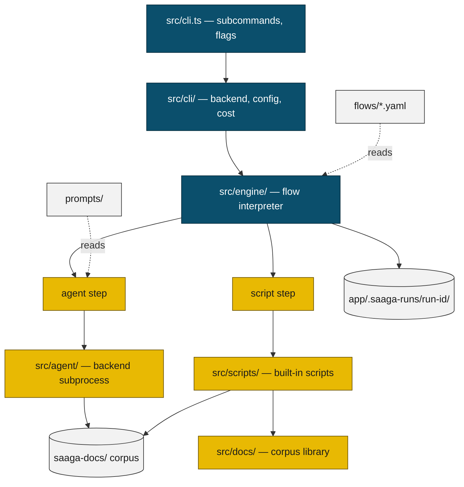

# Architecture

Saaga is a Node CLI that drives an external coding-agent CLI — Cursor, Copilot, or
Claude — through a declarative workflow that writes, verifies, and maintains a
domain documentation corpus for a target application, and installs always-on agent
rules so other agents read that corpus before touching source.

## Overall Architecture

The system is three layers deep:

1. **CLI shell** (`src/cli.ts`, `src/cli/`) resolves everything a run needs before
   any work starts: project config, backend and its per-key models, cost approval,
   the agent permission profile, and a fresh run directory.
2. **Flow engine** (`src/engine/`) interprets a flow definition read from a YAML
   file. It knows steps, scope variables, and control flow, and nothing about
   documentation.
3. **Step implementations** are of exactly two kinds. An *agent step* renders a
   prompt template and hands it to a backend subprocess; a *script step* calls a
   deterministic TypeScript function from a registry.

That two-kind split is the central design decision. Judgement — what deserves a
document, whether a document is true — belongs to the agent. Anything checkable —
hashing files, parsing a plan, validating links, installing rules — belongs to a
script, where it is unit-testable and costs no tokens.

Workflow behaviour lives in data, not code: `flows/`, `prompts/`, and `rules/` ship
with the package and are read from disk at runtime, so a workflow changes without
touching TypeScript.

Two directories anchor a run: the corpus in the target repository (`saaga-docs/` by
default) is the product, and `<app>/.saaga-runs/<run-id>/` holds the run's log,
manifest, journal, and intermediate artifacts.

The CLI has three subcommands. `run <flow> [dir]` executes or resumes a bundled
flow against an application directory, and is the only one gated behind a cost
confirmation. `install-rules` writes the documentation rules into a repository with
no agent or credentials. `doctor` reports backend availability and capability, and
spends model calls at its full tier. Flags, exit codes, and error handling belong to
the [CLI feature document](./features/cli-entry-point.md).

## Modules

### `src/cli.ts` — entry point

Defines the command surface with commander, wires a subcommand invocation to the
layers below it, and owns the run lifecycle: cost confirmation, backend preflight,
permission-profile construction, manifest bookkeeping, cooperative Ctrl+C shutdown,
and the permission-audit summary. Sits at the top of the import graph and reaches
every layer below it.

### `src/cli/` — invocation resolution

Turns flags and [`.saaga/config.yaml`](./concepts/project-configuration.md) into the
concrete things a run is configured with: the backend and an `Agent` for it, the
model behind each model key the flow asks for, and the confirmed cost notice.
[Backend resolution and model-key precedence](./concepts/backend-resolution.md) live
here. Depends on `src/agent/` for the backend constructors.

### `src/engine/` — flow engine

Loads a [flow definition](./concepts/flow-definitions.md), then executes its steps
against a mutable scope: sequencing, the `foreach`/`loop`/`if`/`read-file`
primitives, the [expression language](./concepts/scope-and-expressions.md) behind
`${…}` interpolation and predicates, phase numbering, prompt archiving, and the
[step journal that makes a run resumable](./features/flow-execution.md). Agent and
script execution are delegated: it depends on the `Agent` interface and the registry.

### `src/agent/` — agent backends

Implements the single [`Agent` interface](./concepts/agent-interface.md) once per
supported CLI (Cursor, Copilot, Claude, plus a fake used by tests), translating a
rendered prompt and a permission profile into that CLI's own argv and permission
syntax. Also owns the [permission profile](./concepts/agent-permissions.md) itself,
[agent event parsing](./concepts/agent-events.md), subprocess streaming, and denial
auditing. Depends on no other `src/` module.

### `src/scripts/` — built-in scripts

The deterministic half of a flow: one exported handler per built-in script, plus
the [registry that names them](./concepts/script-registry.md) for `script:` steps —
plan parsing, [baseline and change detection](./concepts/baseline-and-change-detection.md)
over a `.gitignore`/`.saagaignore`-aware file manifest, rule installation, the
[corpus gates](./features/corpus-gates.md), and the quick-update artifact lifecycle.
Depends on `src/docs/` for corpus analysis.

### `src/docs/` — corpus library

Pure analysis of a documentation corpus, with no flow or CLI knowledge:
[frontmatter, the link and mermaid-fence graph, structural validation](./concepts/corpus-documents.md),
[generated navigation pages](./features/navigation-generation.md), the
[corpus size budget](./concepts/corpus-budget.md) derived from a repository, and the
corpus format-version stamp. Depends on `src/scripts/file-manifest.ts` for in-scope
file enumeration.

### `src/doctor/` — environment diagnostics

[Probes whether a backend CLI is installed](./features/doctor.md), which flags it
still accepts, and whether it can complete real work, at a fast tier that spends
nothing and a full tier that makes model calls in a scratch repository against a
real `Agent`. Also provides the preflight check the `run` subcommand performs
before spending on a flow. Depends on `src/cli/` and `src/agent/`.

### `src/templates.ts` — prompt rendering

Renders a [prompt template](./concepts/prompt-templates.md) into the text an agent
step sends: variable substitution with a hard failure on a missing variable, and
include directives confined to the configured search roots. Depends on nothing but
the filesystem.

### `src/run-context.ts`, `src/run-manifest.ts` — run identity

[Allocate a run id and its directory under `<app>/.saaga-runs/`](./concepts/run-context.md),
and record what a run was — flow, flow hash, backend, models, initial scope, status
— so a later invocation can find an interrupted run and resume it consistently.
`src/run-context.ts` has no dependencies within `src/`; `src/run-manifest.ts`
depends on `src/model-keys.ts` and on the engine's `Scope` type.

### `src/logger.ts`, `src/output.ts`, `src/paths.ts`, `src/model-keys.ts`, `src/saaga-rules.ts`, `src/unstable-features.ts`

Widely imported helpers: run and terminal logging, progress formatting,
package-relative asset roots, the model-key vocabulary shared by engine and CLI,
`.saagarules` loading for user instructions appended to every agent prompt, and the
process-wide unstable-feature registry. `src/logger.ts` builds on `src/output.ts`;
the other five are leaves with no internal dependencies.

### `flows/` — flow definitions

The bundled workflows as YAML: [`init` (document a repository from scratch)](./features/init-workflow.md),
[`update` (re-document what changed)](./features/update-workflow.md),
[`quick-update` (record a small change for later folding in), and `verify-quick-updates`](./features/quick-update-workflows.md).
Each flow's step sequence is owned by that workflow's feature document. Data only —
no code, and user-editable.

### `prompts/` — prompt templates

One Markdown template per agent step — planning, architecture, slice writing,
verification, fixing, quick updates — over a `partials/` directory of shared
fragments carrying the document templates, level-of-detail policy, single-home
rule, and quality checklists. Read by `src/templates.ts`; data only.

### `rules/` — installable rule templates

The always-on rule text that [`install-rules`](./features/install-rules.md) writes
into a target repository: one shared body, plus a wrapper template for each of the
two targets whose file Saaga owns outright. Data only.

### `tests/` — test suite

Vitest suite mirroring `src/` directory for directory, plus end-to-end CLI tests
that drive `runCli` with the fake agent, and checks over this repository's own CI
and environment configuration. Not shipped in the package.

### `eval/` — paired eval harness

A [repo-only experiment measuring whether the corpus helps a coding agent](./features/eval-harness.md):
it runs pre-registered tasks in isolated sandboxes under different documentation
conditions, scores them, and reports pass rate and token/turn spread per
condition. Its sandbox, checks, and task registry are independent of `src/`, but
its runner reuses the `Agent` types and its entry point the backend factory.

### `.github/` — CI and scheduled runs

Workflows for lint/test, the two doctor tiers, and the scheduled
quick-update and verification runs against this repository's own corpus, plus the
publish script. Repository infrastructure, not part of the package.
