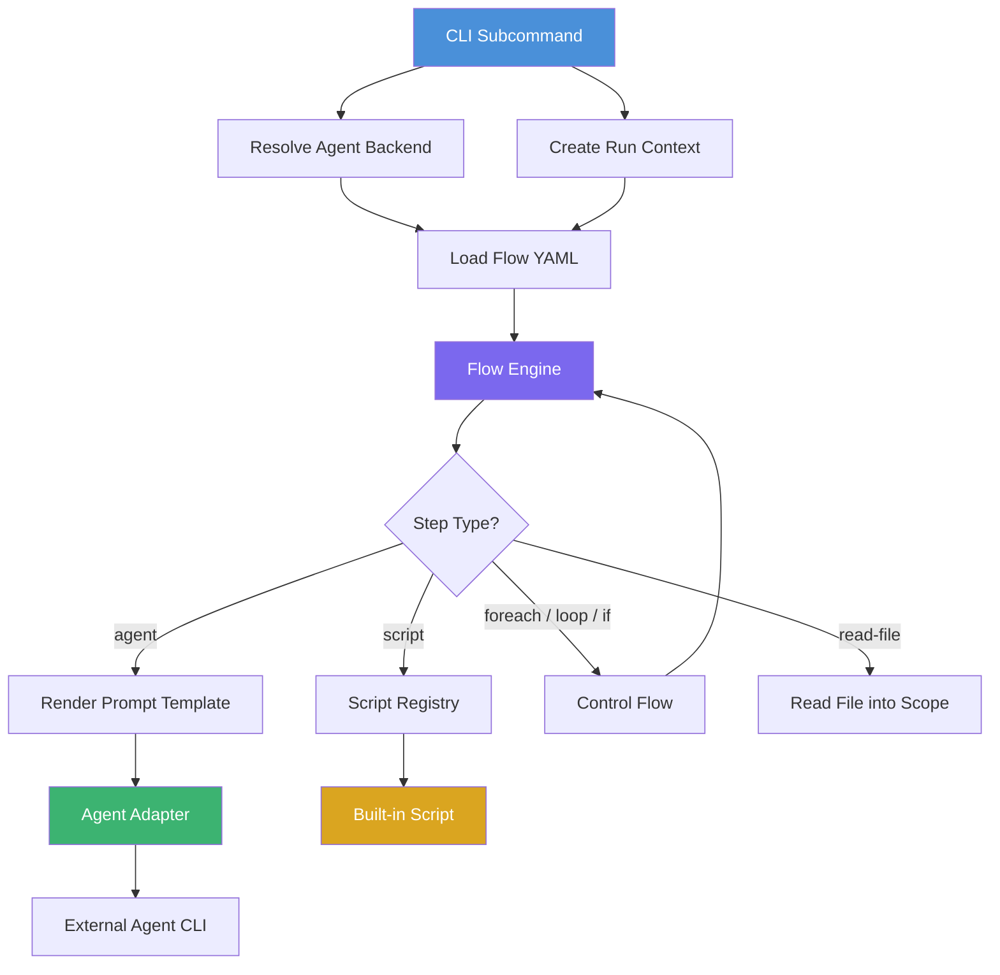

# Architecture — Saaga

`saaga` is a CLI tool that orchestrates AI coding agents (Cursor, GitHub Copilot, Claude) to generate and maintain domain documentation for software projects. It executes declarative YAML workflows that combine agent invocations, built-in scripts, and control-flow primitives.

## Overall Architecture

The system is structured as a pipeline:

```
CLI (commander) → Backend/Agent resolution → Flow loading → Flow engine execution
```

1. The **CLI** parses subcommands and global flags, resolves the agent backend, and creates a run context (unique ID + output directory).
2. The **Flow Loader** reads the YAML flow file for the chosen subcommand.
3. The **Flow Engine** executes each step sequentially. Steps can invoke an agent with a rendered prompt, call a built-in script, or use control-flow primitives (`foreach`, `loop`, `if`, `read-file`).
4. **Agent adapters** shell out to external CLI tools (`cursor-agent`, `copilot`, `claude`) to perform AI-driven work.
5. **Built-in scripts** handle structured data operations (plan parsing, change detection, baseline generation, rule installation) that are better expressed in code than in agent prompts.

### Data Flow



### Key Design Decisions

- **Declarative orchestration**: Workflow logic lives in YAML flow files, not application code. Adding or reordering steps requires no code changes.
- **Agent-agnostic**: The `Agent` interface abstracts over backends. The engine never references a specific agent implementation.
- **Scope-based data flow**: All inter-step communication flows through a mutable scope dictionary. Steps read from and write to scope variables using `${var}` expressions.
- **Run isolation**: Each invocation gets a unique run directory under `<appPath>/.saaga-runs/<run-id>/` for plans, reviews, and status files.
- **Permission restriction**: Agents run under a restricted permission profile by default. The profile declares read roots, write roots, deny paths, and a shell policy. Each backend translates the profile into its native permission mechanism (Cursor: `cli-config.json` deny rules; Copilot: `--available-tools` + `--disallow-temp-dir`; Claude: `--permission-mode dontAsk` + `--settings` JSON). The `--dangerously-allow-all` flag disables restrictions. The `--audit-permissions` flag enables structured output parsing and denial classification.
- **No git dependency**: File manifests, hashing, and change detection are implemented in pure Node.js. No git CLI is required at runtime.

## Modules

### CLI (`src/cli.ts`)

Entry point. Defines three top-level subcommands (`run`, `install-rules`, `doctor`) using `commander`. `saaga run <flow>` resolves the agent, runs a preflight check, creates a run context, constructs a permission profile, loads the named flow (`init`, `update`, `quick-update`, or `verify-quick-updates`), and calls the engine. Omitting the flow name lists bundled flows (name + optional YAML `description`) via `listFlows()`. Former top-level flow commands remain as hidden stubs that print a migration message to `saaga run <flow>`. The `install-rules` subcommand is standalone: it runs the rule installer directly without an agent backend. The `doctor` subcommand checks backend CLI availability and runs diagnostic probes without a flow.

Global flags include `--backend`, `--model <key>=<model>` (repeatable), `--ci`, `--verbose`, `--yes` (`-y`), `--allow-dir <path>` (repeatable), `--unstable-feature <name>` (repeatable), `--dangerously-allow-all`, and `--audit-permissions`. The `--verbose` flag enables detailed step output and live agent output on the terminal. The `--yes` flag skips the cost confirmation prompt for agent-backed commands. `--allow-dir` grants additional read/write access to a directory and can be repeated. `--unstable-feature` enables opt-in experimental features (unioned with `config.unstableFeatures`). `--dangerously-allow-all` disables permission restrictions entirely (reproduces legacy behavior). `--audit-permissions` scans agent output for permission denials and logs a classified summary.

Each subcommand bootstraps unstable features via `bootstrapUnstableFeatures()` before other work: it validates the directory, loads config, validates CLI feature names, initializes the process-wide registry, and warns on stderr when any features are enabled. Unknown CLI feature names throw `UnstableFeatureError` (exit code 1).

`runFlowSubcommand()` calls `confirmAgentCosts()` before creating the run context. The cost notice uses `backendCliCommand()` to determine the CLI binary name, or falls back to the agent's `name` when the agent was injected directly. After cost confirmation and before run context creation, it runs a preflight check via `runPreflight()` for the resolved backend (skipped when the agent is injected for tests). A `PreflightError` is thrown on failure, directing the user to `saaga doctor` for details.

After creating the run context, it constructs a permission profile via `buildProfile()` (unless `--dangerously-allow-all` is set) and writes `permissions.json` to the run directory. When `--audit-permissions` is set and a profile exists, a `PermissionAuditor` is created. It loads `.saagarules` via `loadSaagaRules()` and passes `permissions`, `auditor`, and `saagaRules` to `runFlow()` via `RunFlowDeps`. After flow completion, `reportAudit()` flushes the audit log and warns about denials inside granted paths.

`createLogger()` accepts an optional `logFile` parameter and the `verbose` flag, forwarding them to the `Logger` constructor (which delegates to `OutputSink`).

**Exports**: `runCli(argv, options): Promise<number>`, `CliOptions`

`CliOptions` fields: `agent?: Agent` (injected agent for tests), `cwd?: string`, `stdout?: NodeJS.WritableStream`, `stderr?: NodeJS.WritableStream`, `stdin?: NodeJS.ReadableStream` (used by cost confirmation prompt in tests).

Error handling catches `AgentStepFailedError` (returns exit code), `ConfirmationDeclinedError` (writes message to stderr, returns exit code 1), `UnstableFeatureError` (writes `[ERROR]` message to stderr, returns exit code 1), `DoctorError` (returns the doctor exit code), `PreflightError` (returns exit code 1), and Commander info exits (version/help, returns 0).

> **Internal implementation:**
>
> - `bootstrapUnstableFeatures()` validates the project directory, loads config, resolves config+CLI unstable features, initializes the registry, and emits a single enablement warning.
> - `resolveAgent()` returns a `ResolvedAgent` containing the `Agent` plus optional `backend` and `model` fields (absent when the agent was injected via `CliOptions.agent`). These resolution details are passed to `confirmAgentCosts()` for the cost notice.
> - `isInteractive()` is not in this module — it lives in `cli/confirm.ts`.
> - `reportAudit()` flushes the auditor, logs total denial count and the audit log path, and emits a warning for each `unexpected` denial (inside a granted path).
> - `splitProbeIds()` normalizes comma- and space-separated `--probe` values for the doctor subcommand.
> - `UnstableFeatureError`, `PreflightError`, and `DoctorError` are error classes with `exitCode` fields.

**Dependencies**: `cli/config`, `cli/backend`, `cli/confirm`, `engine/loader`, `engine/runner`, `run-context`, `logger`, `paths`, `scripts/install-rules`, `agent/permissions`, `agent/audit`, `doctor/index`, `doctor/preflight`, `saaga-rules`, `unstable-features`

### Config (`src/cli/config.ts`)

Loads and validates project-level configuration from `.saaga/config.yaml`. Returns an empty config object when the file does not exist, enabling zero-config usage. Throws `ConfigError` on malformed YAML or invalid field types.

**Exports**: `loadConfig(projectDir): Promise<SaagaConfig>`, `SaagaConfig` interface, `BackendConfig` interface, `ConfigError` class, `CONFIG_DIR` (constant: `".saaga"`), `CONFIG_FILE` (constant: `"config.yaml"`), `DEFAULT_DOCS_DIR` (constant: `"saaga-docs"`)

**`SaagaConfig` fields**: `defaultBackend?: string`, `backends?: Partial<Record<Backend, BackendConfig>>`, `ruleTargets?: string`, `docsDir?: string`, `autoApprove?: boolean`, `unstableFeatures?: string[]`

**`BackendConfig` fields**: `models?: Record<string, string>` — open map of model key → model name

**Dependencies**: `yaml` (npm package), `unstable-features`, `cli/backend` (`isValidModelKey`)

### Backend (`src/cli/backend.ts`)

Resolves which agent backend to use and constructs the concrete `Agent` instance.

**Exports**: `resolveBackend(input): Backend`, `parseModelOverrides(entries): Record<string, string>`, `mergeModelOverrides(configModels?, cliOverrides?): Record<string, string>`, `resolveModel(backend, key, models?): string`, `backendCliCommand(backend): string`, `createAgent(opts): Agent`, `isValidModelKey(key): boolean`, `Backend` type, `ModelKey` type, `BuiltinModelKey` type, `BUILTIN_MODEL_KEYS`, `MODEL_KEY_PATTERN`, `BackendError`, `ResolveBackendInput`, `CreateAgentOptions`

`resolveModel()` returns the model string for a model key, consulting an optional models map before falling back to `DEFAULT_BACKEND_MODELS` for built-in keys `low` / `medium` / `high`. Unknown keys with no configured value throw `BackendError`.

`backendCliCommand()` returns the CLI binary name that Saaga executes for a given backend (e.g. `"cursor-agent"` for cursor, `"copilot"` for copilot, `"claude"` for claude). Used by the CLI to populate the cost notice.

> **Internal constants:** `BACKEND_CLI_COMMANDS` — a `Record<Backend, string>` mapping each backend to its CLI command name. `DEFAULT_BACKEND_MODELS` — per-backend built-in defaults keyed by `low` / `medium` / `high`.

**Resolution precedence**: `--backend` flag → `.saaga/config.yaml` `defaultBackend` field → error. Model keys: `--model <key>=<model>` → `backends.<backend>.models.<key>` → built-in default (`low`/`medium`/`high` only) → error.

`ResolveBackendInput` carries `flag?: string` (from CLI `--backend`) and `config?: string` (from `.saaga/config.yaml` `defaultBackend` field).

**Dependencies**: `agent/copilot-agent`, `agent/cursor-agent`, `agent/claude-agent`, `agent/types`

### Confirm (`src/cli/confirm.ts`)

Handles the cost confirmation prompt shown before agent-backed subcommands start. Displays a cost disclaimer naming the backend CLI and model, reminds the user that agent usage is billed to their own account, and on interactive terminals asks for `y/N` confirmation. Non-interactive invocations (piped stdin, `--ci`) print the notice and continue without blocking. The prompt can be skipped entirely via `--yes` flag or `autoApprove: true` in config.

**Exports**: `confirmAgentCosts(input): Promise<void>`, `buildCostNotice(input): string`, `buildCostSummary(input): string`, `ConfirmationDeclinedError` class, `CostNoticeInput` interface, `CostConfirmationInput` interface

`CostNoticeInput` fields: `subcommand: string`, `appPath: string`, `backendCli: string`, `backend?: string`, `model?: string`

`CostConfirmationInput` extends `CostNoticeInput` with: `autoApprove: boolean`, `ci: boolean`, `stdin?: NodeJS.ReadableStream`, `stream: NodeJS.WritableStream`

`ConfirmationDeclinedError` carries `exitCode = 1` and a default message of `"aborted: cost confirmation declined"`.

> **Internal implementation:**
>
> - `COST_HINTS` — a `Record<string, string>` mapping each agent-backed subcommand (`init`, `update`, `quick-update`, `verify-quick-updates`) to a human-readable cost expectation sentence appended to the notice.
> - `isInteractive(input)` — returns `false` when `ci` is true, `stdin` is absent, or `stdin.isTTY` is not true.
> - `ask(input)` — opens a `readline` interface and races the user's answer against an EOF/close event. Only `"y"` or `"yes"` (case-insensitive) is accepted.
> - `describeResolution(input)` — formats the `(backend X, model Y)` suffix for the notice text.

**Dependencies**: `node:readline/promises` (Node.js built-in)

### Agent (`src/agent/`)

Defines the `Agent` interface, its implementations, and supporting modules for permissions, event parsing, auditing, I/O routing, and process management.

#### Interface (`src/agent/types.ts`)

```typescript
interface Agent {
  name: string;
  run(prompt: string, opts: AgentRunOpts): Promise<AgentRunResult>;
}
```

`AgentRunOpts` carries `cwd`, an optional `AbortSignal`, `additionalDirs?: string[]` (the run directory, used by CursorAgent to place its `cli-config.json`), `permissions?: AgentPermissions` (absent means unrestricted — the backend uses legacy flags), `logFile?: string` (absolute path to append the agent's stdout/stderr to), `echo?: boolean` (also mirror output to the terminal under `--verbose`), and `onEvent?: AgentEventSink` (when set, the backend switches to structured JSON output and forwards parsed events). `AgentRunResult` carries `exitCode`.

#### Permissions (`src/agent/permissions.ts`)

Defines the declarative permission profile that restricts what agent backends can access during runs.

**Exports**: `AgentPermissions` (interface), `buildProfile(input): AgentPermissions`, `enumerateExcludedPaths(keepPaths): Promise<string[]>`, `BuildProfileInput` (interface), `ALLOWED_SHELL_COMMANDS` (constant)

`AgentPermissions` fields: `readRoots: string[]`, `writeRoots: string[]`, `denyPaths: string[]`, `shell: "none" | "restricted"`.

`buildProfile()` constructs the default restricted profile: read access to the entire app tree, write access to `<app>/<docsDir>` and the run directory, deny list covering rule files (`AGENTS.md`, `CLAUDE.md`, `.cursor/rules/**`, `.github/instructions/**`), `.saagarules`, and `BASELINE`, shell policy of `"restricted"`. Additional directories from `--allow-dir` are appended to both `readRoots` and `writeRoots`.

`enumerateExcludedPaths()` walks the ancestor chain of each keep path and lists every sibling not on the path, producing the deny list needed by backends that honour deny rules but not allow rules.

`ALLOWED_SHELL_COMMANDS` contains the commands permitted under the `"restricted"` shell policy, organized into two keys: `utilities` (`cd`, `ls`, `pwd`, `grep`, `head`, `tail`, `wc`, `dirname`, `basename`) and `git` read-only subcommands (`log`, `show`, `diff`, `blame`, `status`, `ls-files`, `cat-file`, `rev-parse`). Each backend translates these into its native permission syntax (Cursor `Shell(...)`, Copilot `shell(...)`, Claude `Bash(...)`).

#### Events (`src/agent/events.ts`)

Normalized event types parsed from backend-specific structured output.

**Exports**: `DenialEvent` (interface), `SessionEvent` (interface), `AgentEvent` (type), `AgentEventSink` (type), `EventParser` (interface), `LineSplitter` (class), `parseJsonLine(line): Record<string, unknown> | undefined`, `consumeEvents(stream, parser, sink): Promise<void>`

`AgentEvent` is a discriminated union: `DenialEvent` (a tool call refused on permission grounds, carrying `tool`, optional `path`, optional `command`, and `message`) or `SessionEvent` (the toolset announced at session start, carrying `tools: string[]`).

`LineSplitter` reassembles whole lines from arbitrarily chunked stream data. `consumeEvents()` drives a parser over an async iterable stream, forwarding every parsed event to the sink.

#### Audit (`src/agent/audit.ts`)

Classifies and summarizes permission denials after a run.

**Exports**: `PermissionAuditor` (class), `classifyDenial(event, perms, cwd): ClassifiedDenial`, `DenialClass` (type), `ClassifiedDenial` (interface), `AuditResult` (interface)

`DenialClass` is `"unexpected" | "out-of-workspace" | "protected-path" | "shell" | "unknown"`. `classifyDenial()` places a denial against the permission profile by comparing the resolved path to the read/write roots and deny paths.

`PermissionAuditor` collects denial events via `record(event)`, classifies each one, and writes a grouped summary via `flush(): Promise<AuditResult>`. Within each class, repeats fold by tool plus target: shell denials key on `event.command` (so distinct pathless shell refusals stay separate), and other denials key on the resolved path. The `AuditResult` carries `logPath`, `counts` per class, and the list of `unexpected` denials (those inside a granted path, indicating a profile bug).

#### Spawn (`src/agent/spawn.ts`)

**Exports**: `awaitProcess(proc, events?): Promise<number>`, `EventConsumer` (interface)

Awaits a spawned agent process while concurrently draining its stdout for event parsing. Without concurrent draining, a long transcript would fill the OS pipe buffer and deadlock the child process.

#### Stdio (`src/agent/stdio.ts`)

**Exports**: `buildStdio(opts): Record<string, unknown>`, `buildPipedStdio(opts): Record<string, unknown>`

`buildStdio()` configures execa stdio options for an agent invocation. When no `logFile` is set, inherits the parent's stdio streams. When `logFile` is set, redirects stdout/stderr to the file. When both `logFile` and `echo` are set, tees to both. Always sets `stdin: "ignore"`.

`buildPipedStdio()` pipes stdout through the Node process so callers can parse the event stream (used by `--audit-permissions` and probe log capture). Only stdout is piped — stderr goes directly to the log file to avoid deadlocks from an unread pipe buffer.

#### CursorAgent (`src/agent/cursor-agent.ts`)

**Unrestricted mode**: Invokes `cursor-agent --print --force --model <model> --output-format text`.

**Restricted mode** (when `opts.permissions` is set): Invokes `cursor-agent --print --trust --model <model> --output-format <text|stream-json>`. Writes a `cli-config.json` under `<runDir>/.cursor-cli/` with deny rules computed by `enumerateExcludedPaths()` for both read and write boundaries. Read-only git subcommands are allowed via `Shell(git:<subcommand>*)` rules. The `CURSOR_CONFIG_DIR` environment variable is set to the config directory.

**Exports**: `CursorAgent` (class), `CursorAgentOptions` (interface), `createCursorEventParser(): EventParser`

`createCursorEventParser()` handles cursor's `stream-json` output, recognizing `writePermissionDenied`, `rejected`, and `error` result shapes as denials.

#### CopilotAgent (`src/agent/copilot-agent.ts`)

**Unrestricted mode**: Invokes `copilot -p <prompt> --allow-all-tools --no-ask-user --model <model> --no-auto-update`. Passes `--add-dir <dir>` for each entry in `opts.additionalDirs`.

**Restricted mode**: Uses `--available-tools view create edit glob grep [bash] --allow-tool write[,shell(...)] --disallow-temp-dir`. The `--available-tools` flag restricts the model's tool surface, adding `bash` only when the profile's `shell` is `"restricted"`. `--allow-tool` grants `write` plus, when shell is restricted, a `shell(<command>:*)` / `shell(git:<subcommand>*)` pattern for each entry in `ALLOWED_SHELL_COMMANDS`. `--disallow-temp-dir` closes the automatic temp directory access. Copilot cannot scope writes within the workspace — its deny rules are inert once tool access is granted — so only the workspace boundary is enforced for file changes.

Temporarily renames `.gitignore` to `.gitignore.<random-hex>.bak` before invocation. The random suffix (8 hex characters from `randomBytes(4)`) prevents collisions between concurrent agent runs.

**Exports**: `CopilotAgent` (class), `CopilotAgentOptions` (interface), `createCopilotEventParser(): EventParser`

`createCopilotEventParser()` handles copilot's JSONL output, correlating `tool_call` requests with `tool.execution_complete` events carrying `error.code: "denied"`.

#### ClaudeAgent (`src/agent/claude-agent.ts`)

**Unrestricted mode**: Invokes `claude --print --dangerously-skip-permissions --model <model>`.

**Restricted mode**: Invokes `claude --print --permission-mode dontAsk --strict-mcp-config --model <model> --settings <JSON>`. The settings JSON expresses the permission profile as `Edit(//<root>/**)` allow rules for write roots, tool denials for unwanted tools (`Task`, `WebFetch`, `WebSearch`, subagent/cron tools, etc.), and `additionalDirectories` for read roots outside `cwd`. When the profile's `shell` is `"restricted"`, `Bash(<command>:*)` / `Bash(git <subcommand>:*)` allow rules are added for each `ALLOWED_SHELL_COMMANDS` entry, paired with `Bash(...)` denies for Claude's built-in read-only Bash commands that fall outside that policy (`cat`, `echo`, `find`, `python3`, etc. — Claude auto-runs these under `dontAsk` regardless of `permissions.allow`). When `shell` is `"none"`, a bare `Bash` deny is used instead, since it would otherwise override any scoped allow. When `onEvent` is set, adds `--verbose --output-format stream-json`.

**Exports**: `ClaudeAgent` (class), `ClaudeAgentOptions` (interface), `createClaudeEventParser(): EventParser`, `CLAUDE_RESTRICTED_TOOLS` (constant)

`CLAUDE_RESTRICTED_TOOLS` lists the expected tool surface under a restricted profile: `Bash`, `Edit`, `Read`, `Write`. The `claude/tool-surface` doctor probe asserts this set against the session event.

`createClaudeEventParser()` handles claude's `stream-json` output, correlating `tool_use` blocks with `tool_result` errors matching denial patterns.

#### FakeAgent (`src/agent/fake-agent.ts`)

Test double. Returns canned results keyed by substring match against the prompt. Records all calls (including `additionalDirs`, `permissions`, and `onEvent`) in `FakeAgentCall` for assertion. Supports optional side-effect callbacks to simulate file writes.

### Doctor (`src/doctor/`)

Diagnostic system for checking backend CLI availability and running capability/restriction probes.

#### Index (`src/doctor/index.ts`)

Orchestrates the doctor workflow: checks backend availability, runs fast-tier or full-tier probes, and formats results.

**Exports**: `runDoctor(opts): Promise<DoctorResult>`, `formatDoctorResult(result, opts?): string`, `DoctorOptions` (interface), `DoctorResult` (interface), `DoctorBackendResult` (interface)

`DoctorOptions` fields: `backend: Backend | "all"`, `level: ProbeLevel`, `json?: boolean`, `probe?: string[]`, `modelOverrides?: Record<string, string>`, `backendModels?: Partial<Record<Backend, BackendConfig>>`, `ci?: boolean`, `cwd?: string`.

`DoctorResult` fields: `schemaVersion: 1`, `backends: DoctorBackendResult[]`, `exitCode: number`, `logDir?: string`. Exit codes: 0 = all passed, 1 = at least one failed, 2 = could not run (binary missing).

`DoctorBackendResult` fields: `backend: Backend`, `available: boolean`, `reason?: string`, `version?: string`, `probes: ProbeRunResult[]`.

For full-tier runs, logs are placed under `<cwd>/.saaga-runs/doctor/<timestamp>/`.

#### Probes (`src/doctor/probes.ts`)

Defines the probe catalogue as data.

**Exports**: `PROBE_CATALOGUE: ProbeDefinition[]`, `ProbeDefinition` (interface), `ProbeLevel` (type), `ProbeRunResult` (interface), `ProbeClassification` (type)

`ProbeLevel` is `"fast" | "full"`. `ProbeClassification` is `"policy-denial" | "backend-failure" | "transient"` — `transient` means a capability probe failed then passed on retry under the same profile; the other two are established by rerunning a persistently failed capability probe without the profile.

`ProbeRunResult` fields: `probeId: string`, `backend: Backend`, `status: "pass" | "fail" | "skip"`, `classification?: ProbeClassification`, `exitCode: number`, `elapsed: number`, `error?: string`, `retries?: number`.

The catalogue includes fast-tier probes (`version`, `required-flags`, `unknown-model-fails`) and full-tier probes (`handshake`, `write-in-cwd`, `read-from-cwd`, `read-gitignored`, `write-run-dir`, `read-outside-workspace-denied`, `write-outside-workspace-denied`, `arbitrary-shell-denied`, `write-source-denied`, `rule-files-denied`, `baseline-denied`, `restricted-shell-utility-allowed`, `read-only-git-allowed`, `git-mutation-denied`, `claude/tool-surface`, `claude/absolute-path-anchoring`, `claude/run-dir-writable`). Some probes are backend-specific (noted in `backends` field).

#### Required Flags (`src/doctor/required-flags.ts`)

Fast-tier probe data and helpers that assert each backend CLI still documents every flag Saaga passes during agent runs.

**Exports**: `REQUIRED_CLI_FLAGS: Record<Backend, readonly string[]>`, `findMissingRequiredFlags(help, required): string[]`

`REQUIRED_CLI_FLAGS` lists the flags each adapter's `buildArgs` / `run()` path uses (excluding `--version`, which the `version` probe already covers). `findMissingRequiredFlags()` performs token-aware matching so short flags like `-p` do not false-positive against longer ones like `--print`.

#### Full Probes (`src/doctor/full-probes.ts`)

Full-tier probe runner that invokes a real agent in a scratch repository.

**Exports**: `runFullSideEffectProbes(opts): Promise<ProbeRunResult[]>`, `FullProbeRunOptions` (interface)

Each probe defines a `buildPrompt()` and an `assert()`. Probes are classified as `capability` (asserts something works) or `restriction` (asserts something is denied). Failed capability probes are retried up to `CAPABILITY_RETRIES` (2) times under the same profile; a pass on retry is recorded as `classification: "transient"`. Persistent failures are rerun without the permission profile to produce `policy-denial` vs `backend-failure`.

#### Scratch Repo (`src/doctor/scratch-repo.ts`)

**Exports**: `createScratchRepo(): Promise<ScratchRepo>`, `ScratchRepo` (interface)

Creates a disposable git repository in the system temp directory with a known file layout: `src/index.ts` (with a nonce), `build/generated.txt` (gitignored, with a nonce), `AGENTS.md`, `saaga-docs/BASELINE`, `.gitignore`, and an `outside/` directory with a secret file. The scratch repo is initialized as a git repo with an initial commit. A `cleanup()` method removes the entire tree.

#### Preflight (`src/doctor/preflight.ts`)

**Exports**: `runPreflight(backend): Promise<PreflightResult>`, `PreflightResult` (interface)

Runs fast-tier probes for a single backend before starting a flow. Returns `{ passed: boolean, doctorResult }`. Does not throw — the caller decides how to handle failure.

### Engine (`src/engine/`)

The flow execution engine. Loads YAML flow definitions, evaluates expressions, and dispatches steps.

#### Types (`src/engine/types.ts`)

Defines the flow DSL type system:

| Type | Fields |
|------|--------|
| `FlowDefinition` | `name`, `steps: Step[]` |
| `AgentStep` | `prompt`, `vars?`, `expect_file?`, `label?` |
| `ScriptStep` | `name`, `args`, `set?`, `label?` |
| `ForeachStep` | `var`, `in`, `when?`, `do: Step[]`, `label?` |
| `LoopStep` | `max`, `until`, `do: Step[]`, `label?` |
| `IfStep` | `condition`, `then: Step[]`, `label?`, `skip_label?` |
| `ReadFileStep` | `path`, `set`, `trim?`, `label?` |

All step types support an optional `label` field used for phase progress display (interpolated against scope via `${var}` expressions). `IfStep` additionally has `skip_label`, shown in the `[SKIP]` line when the condition is false.

`Step` is the discriminated union of all step types. `Scope` is `Record<string, unknown>`.

#### Loader (`src/engine/loader.ts`)

Reads a `.flow.yaml` file from the `flows/` directory, parses YAML, and validates the structure into a `FlowDefinition`.

**Exports**: `loadFlow(name): Promise<FlowDefinition>`, `loadFlowFromFile(path)`, `parseFlowDefinition(raw)`

#### PhaseTracker (`src/engine/phases.ts`)

Tracks the flat phase index N and dynamically computes the total M for `Phase N/M` progress display. A "phase" is a user-visible unit of work: agent steps, script steps, foreach iterations (one per surviving item after `when` filtering), and skipped if-blocks (one `[SKIP]` line). `read-file` and `loop` steps are plumbing and produce no phase line.

The tracker dynamically recomputes the total by resolving `foreach.in` arrays from scope and evaluating `when` predicates. If a source array has not yet been resolved, `total()` returns `null` and the counter displays `?` (e.g. `Phase 1/?`).

**Exports**: `PhaseTracker` class

Key methods: `advance()` (increments the 1-indexed phase counter), `recordIfOutcome(step, taken)` (records whether an `if` was taken or skipped), `total(scope)` (computes total phases given current scope, returns `null` if indeterminate), `formatCounter(scope)` (returns e.g. `"Phase 7/16"`).

#### Runner (`src/engine/runner.ts`)

Executes a `FlowDefinition` by iterating its steps. Creates a `PhaseTracker` at the start and emits phase progress lines via `Logger.phaseBegin()` / `phaseEnd()` / `phaseImmediate()` calls instead of verbose INFO-banner logging. Dispatches each step by type to the appropriate handler. For `agent` steps: renders the prompt template, invokes `Agent.run()` with `additionalDirs` (the run directory from scope) and `logFile`/`echo` from deps, and optionally asserts that an expected output file exists. On agent failure, prints a tail of the log file for diagnostics.

**Exports**: `runFlow(flow, initialScope, deps)`, `RunFlowDeps`, `AgentStepFailedError`, `ExpectFileMissingError`

`RunFlowDeps` bundles the `Agent`, working directory, optional script registry override, an optional `logger?: Logger`, `logFile?: string` (absolute path to the run log file for agent output capture), `verbose?: boolean` (mirror agent output to terminal), `permissions?: AgentPermissions` (permission profile for agent steps; absent means unrestricted), `auditor?: PermissionAuditor` (collects and classifies permission denials; its presence switches agent steps to structured JSON output), and `saagaRules?: string` (pre-loaded `.saagarules` snapshot appended to every agent prompt). When `logger` is omitted, a silent logger (no-op sink) is used so library callers and tests don't get noise.

#### Expression (`src/engine/expression.ts`)

Handles `${var}` interpolation and predicate evaluation used by `when:`, `until:`, and `if:` clauses.

**Exports**:
- `interpolate(template, scope): string` — replaces `${var.field}` references with string-coerced scope values.
- `resolveValue(expr, scope): unknown` — like `interpolate`, but preserves raw types for sole-reference expressions (needed for `foreach.in` to receive arrays).
- `evaluatePredicate(expr, scope): boolean` — supports `==`, `!=`, `<`, `>`, `<=`, `>=` operators and bare truthy checks.

#### Primitives (`src/engine/primitives/`)

Each control-flow step type has a dedicated handler. All receive a `StepDispatcher` callback to recurse into child steps, avoiding circular imports with the runner.

| Primitive | Behavior |
|-----------|----------|
| `foreach` | Resolves `in` to an array, binds each item to `var` in scope, optionally filters with `when`, executes `do` body. Restores previous scope binding on completion. |
| `loop` | Runs `do` body up to `max` times. Sets `${iteration}` (1-indexed). Exits early when `until` predicate is true. |
| `if` | Executes `then` body when `condition` is true. No `else` branch. |
| `read-file` | Reads a file (path supports `${...}` interpolation) and binds UTF-8 content to a scope variable. Optional `trim`. |
| `script` | Looks up a handler in the script registry, interpolates args, calls it, and optionally binds the return value to a scope variable. |

### Scripts (`src/scripts/`)

Built-in script handlers invoked by `script` steps. Registered in a `ScriptRegistry` map.

#### Registry (`src/scripts/registry.ts`)

**Exports**: `defaultScriptRegistry: ScriptRegistry`, `ScriptHandler` type, `ScriptContext` type

The default registry maps: `"parse-plan"` → `parsePlan`, `"detect-changes"` → `detectChanges`, `"generate-baseline"` → `generateBaseline`, `"archive-quick-update"` → `archiveQuickUpdate`, `"collect-quick-updates"` → `collectQuickUpdates`, `"remove-quick-updates"` → `removeQuickUpdates`, `"install-rules"` → `installRules`, `"ensure-gitignore"` → `ensureGitignore`.

#### parse-plan (`src/scripts/parse-plan.ts`)

Reads a plan file, extracts YAML frontmatter, and returns `Phase[]` (each with `number` and `title`). Used by `init`, `update`, and `verify-quick-updates` flows to drive the `foreach` loop over phases.

#### detect-changes (`src/scripts/detect-changes.ts`)

Compares the current work tree against `<app>/<docs_dir>/BASELINE`. Classifies differences as: changed, new, truly deleted, newly ignored. Writes a markdown report to `<output_dir>/changes.md` and returns counts. The `update` and `quick-update` flows use `${changes.count}` to skip work when nothing changed.

#### generate-baseline (`src/scripts/generate-baseline.ts`)

Writes `<app>/<docs_dir>/BASELINE` containing a `# Generated:` timestamp header and one `<hash> <path>` line per in-scope file, excluding `<docsDir>/`, `.saagaignore`, `.git/`, and any path matched by `.gitignore`/`.saagaignore` patterns. Hashes are computed locally without git CLI.

#### ensure-gitignore (`src/scripts/ensure-gitignore.ts`)

Ensures a given pattern (e.g. `.saaga-runs/`) is present in the project's `.gitignore`. Creates the file if it does not exist. Used as the first step of the init flow to prevent run artifacts from being committed.

**Exports**: `ensureGitignore()`, `EnsureGitignoreArgs`

`EnsureGitignoreArgs` fields: `app_dir: string`, `pattern: string`.

#### file-manifest (`src/scripts/file-manifest.ts`)

Shared utility used by `detect-changes` and `generate-baseline`. Recursively walks an application directory, honoring nested `.gitignore` and `.saagaignore` files at every directory level with "deepest match wins" semantics (via the `ignore` npm package). Accepts `(appDir, docsDir)` parameters to know which top-level directory to hard-exclude. Hard-excludes `.saaga-runs/` at the top level (run artifacts are never part of the manifest) and the project-root `.saagarules` file. Returns a sorted `FileEntry[]` with SHA-1 git blob hashes computed locally. No git CLI required.

Symlinks are included as manifest entries and hashed git-style (hash of the link target path string, not the linked file's content). Symlinked directories are not traversed.

**Exports**: `computeManifest()`, `gitBlobHash()`, `fileExists()`, `FileEntry`

#### archive-quick-update (`src/scripts/archive-quick-update.ts`)

Copies the detect-changes report into the quick-update metadata folder. Validates that a `summary_path` (if provided) exists on disk before archiving, preventing incomplete artifacts.

**Exports**: `archiveQuickUpdate()`, `ArchiveQuickUpdateArgs`

#### collect-quick-updates (`src/scripts/collect-quick-updates.ts`)

Snapshots all quick-update metadata folders and writes a JSON manifest listing their IDs. Used by `verify-quick-updates` to capture the set of artifacts to process.

**Exports**: `collectQuickUpdates()`, `CollectQuickUpdatesArgs`, `CollectQuickUpdatesResult`

#### remove-quick-updates (`src/scripts/remove-quick-updates.ts`)

Deletes exactly the quick-update metadata folders listed in a manifest. Folders created after the snapshot are preserved. Includes path-traversal defense.

**Exports**: `removeQuickUpdates()`, `RemoveQuickUpdatesArgs`

#### install-rules (`src/scripts/install-rules.ts`)

Installs always-on documentation rule stubs into an application directory. Supports four rule targets (`agentsmd`, `cursor`, `claude`, `copilot`) plus `none`. Shared-file targets (`agentsmd`, `claude`) use managed-block upsert between `<!-- saaga:begin/end -->` markers. Owned-file targets (`cursor`, `copilot`) overwrite the file using a wrapper template from `rules/`.

**Exports**: `installRules()`, `parseRuleTargets()`, `InstallRulesArgs`, `RULE_TARGETS`, `RuleTarget`, `MANAGED_BLOCK_BEGIN`, `MANAGED_BLOCK_END`

`InstallRulesArgs` fields: `app_dir: string`, `app: string`, `rule_targets: string`, `docs_dir: string`

### Templates (`src/templates.ts`)

Renders prompt files by substituting `{key}` placeholders with provided variables.

**Exports**: `renderPrompt(template, vars, options): string`, `renderPromptFile(path, vars, options): Promise<string>`, `MissingTemplateVariableError`, `TemplateFileNotFoundError`

Unmatched placeholders are left intact by default (prompts use `{Type}` as literal documentation). Strict mode is available for testing.

### Run Context (`src/run-context.ts`)

Generates a unique run ID and creates the run output directory. Also provides a `date` field (formatted as YYYYMMDD) for use in date-stamped output filenames.

**Exports**: `createRunContext(input): Promise<RunContext>`, `RunContext`, `CreateRunContextInput`

`CreateRunContextInput` fields: `app: string` (display name), `subcommand: string` (label embedded in run ID), `appPath: string` (required; absolute path to the application directory), `now?: Date` (test override).

**ID format**: `<app>-<subcommand>-<YYYYMMDD>-<HHMMSS>-<8 hex chars>`

**Directory**: `<appPath>/.saaga-runs/<run-id>/`

### Paths (`src/paths.ts`)

Resolves package-root-relative directory constants.

**Exports**: `PACKAGE_ROOT`, `FLOWS_DIR`, `PROMPTS_DIR`, `RULES_DIR`

Works identically whether running from `src/` (via `tsx`) or `dist/` (compiled).

### Saaga Rules (`src/saaga-rules.ts`)

Loads optional project-root `.saagarules` instructions and appends them to agent prompts with an explicit bounded-priority wrapper.

**Exports**: `loadSaagaRules(projectRoot): Promise<string | undefined>`, `appendSaagaRules(prompt, rules): string`, `SaagaRulesError`, `SAAGA_RULES_FILE` (constant: `".saagarules"`)

Missing or whitespace-only files return `undefined`. Files over 64 KiB or with invalid UTF-8 throw `SaagaRulesError`. The CLI loads once per flow run and passes the snapshot as `RunFlowDeps.saagaRules`; the runner appends on every agent step.

### Unstable Features (`src/unstable-features.ts`)

Typed registry and process-wide enablement for opt-in experimental features.

**Exports**: `UNSTABLE_FEATURES`, `UnstableFeature`, `isUnstableFeature()`, `findUnknownFeature()`, `resolveUnstableFeatures()`, `initUnstableFeatures()`, `isUnstableFeatureEnabled()`, `getEnabledUnstableFeatures()`, `resetUnstableFeatures()`

`UNSTABLE_FEATURES` is the single source of truth for valid names (currently `none`). Config and CLI values are unioned (config first), validated, and initialized once per CLI invocation.

### Logger (`src/logger.ts`)

Facade over `OutputSink` that provides the runner-facing logging API. The `Logger` constructor creates an `OutputSink` internally; alternatively, `Logger.fromSink(sink, opts)` wraps an existing `OutputSink` (used by `child()` to share the same sink across nested scopes).

**Exports**: `Logger` class, `LoggerOptions`, `silentLogger()` function

`LoggerOptions` fields: `ci?: boolean` (plain text mode, default `false`), `stream?: NodeJS.WritableStream` (output target, default `process.stderr`), `indent?: number` (spaces prepended after the level tag, default `0`), `logFile?: string` (path to append all output to), `verbose?: boolean` (show detail lines and live agent output on terminal).

Methods:
- `info(message)`, `warn(message)`, `error(message)` — leveled log output (with indentation padding)
- `phaseBegin(text)` — start a pending phase line (with spinner in TTY mode)
- `phaseEnd(marker, durationMs)` — complete the pending line with `[DONE]`/`[SKIP]`/`[FAIL]` and duration
- `phaseImmediate(text, marker, durationMs?)` — emit a phase line that is immediately complete (used for `[SKIP]` lines and the final summary)
- `detail(message)` — always goes to the log file; appears on terminal only under `--verbose`
- `logFileSize()` — returns the current size of the log file in bytes
- `tailLog(fromByte, maxLines?)` — reads the last N lines from the log file starting at a byte offset
- `child(extraIndent = 2)` — returns a new `Logger` wrapping the same `OutputSink` with additional indentation
- `getSink()` — returns the underlying `OutputSink`
- `dispose()` — stops the spinner timer

`silentLogger()` returns a `Logger` backed by a no-op writable stream, used when no logger is provided to the runner.

### Output (`src/output.ts`)

Low-level terminal output engine. `OutputSink` manages the pending-line state machine, TTY spinner animation, column-aligned marker rendering, and log-file append. `Logger` wraps `OutputSink` and delegates all output through it.

**Exports**: `OutputSink` class, `OutputSinkOptions` interface, `Marker` type, `formatDuration()`, `truncateLabel()`

`Marker` is a string union: `"DONE" | "SKIP" | "FAIL" | "PASS"`. Rendered as `[DONE]`, `[SKIP]`, `[FAIL]`, `[PASS]` with ANSI color in TTY mode (green for `DONE`/`PASS`, dim for `SKIP`, red for `FAIL` via `picocolors`), plain text in CI mode.

`OutputSinkOptions` fields: `ci?: boolean`, `stream?: NodeJS.WritableStream` (default `process.stderr`), `logFile?: string`, `verbose?: boolean`.

`OutputSink` behavior:
- **Phase lines**: `phaseBegin(text)` writes the line and starts a braille spinner in TTY mode (120ms frame interval). `phaseEnd(marker, durationMs)` clears the spinner and renders `[MARKER] duration` column-aligned at a computed marker column (default column 72, minimum 40, adapts to terminal width). `phaseImmediate(text, marker, durationMs?)` emits a complete line without pending state.
- **Detail lines**: `detail(message)` always appends to the log file; appears on terminal only when `verbose` is true.
- **Level lines**: `info()`, `warn()`, `error()` emit `[LEVEL]` tagged lines to both the stream and log file.
- **Log introspection**: `logFileSize()` returns the current log file size. `tailLog(fromByte, maxLines)` reads the last N lines from the log file starting at a byte offset.
- **Lifecycle**: `dispose()` stops the spinner timer.

`formatDuration(ms)` formats milliseconds as human-readable durations: `<1s` → `"Nms"`, `<60s` → `"N.Ns"`, `≥60s` → `"NmNNs"`.

`truncateLabel(prefix, label, suffix, maxWidth)` truncates the label portion of a phase line to fit within a maximum width while preserving the prefix (`Phase N/M: `) and suffix (`(iteration i/k)`), using an ellipsis character when truncation is needed.

### Flow Definitions (`flows/`)

YAML files that define the step sequence for each subcommand. The engine loads them by name.

| Flow | Subcommand | Steps |
|------|------------|-------|
| `init.flow.yaml` | `init` | Ensure-gitignore → architecture → plan → phase-0 slice → install-rules → foreach phase (slice + verify/fix loop) → generate baseline. All script/prompt steps receive `docs_dir` from scope. |
| `update.flow.yaml` | `update` | Detect changes → if changes exist: plan → foreach phase (slice + verify/fix loop) → regenerate baseline. All script/prompt steps receive `docs_dir` from scope. |
| `quick-update.flow.yaml` | `quick-update` | Detect changes → if changes exist: agent quick-update → read status → if UPDATED: archive-quick-update → generate baseline. Metadata paths use `${docs_dir}`. |
| `verify-quick-updates.flow.yaml` | `verify-quick-updates` | Collect quick-updates → if any: plan → foreach phase (slice + verify/fix loop) → remove processed artifacts. Metadata paths use `${docs_dir}`. |

### Prompt Templates (`prompts/`)

Markdown files with `{var}` placeholders, rendered by the templates module before being passed to an agent.

| Template | Purpose |
|----------|---------|
| `document-architecture.md` | Generate architecture documentation |
| `plan-init.md` | Create initial documentation plan |
| `plan-update.md` | Create incremental update plan from change report |
| `plan-verify-quick-updates.md` | Create verification plan from accumulated quick-update artifacts |
| `quick-update.md` | Fast single-session documentation update |
| `slice-doc.md` | Document a single phase |
| `verify-domain-documentation.md` | Review phase output and produce PASS/FAIL status |
| `fix-documentation.md` | Fix issues identified by verification |

## Module Dependency Graph

```mermaid
flowchart BT
    paths[paths]
    output[output]
    logger[logger]
    templates[templates]
    runctx[run-context]
    saagarules[saaga-rules]
    unstable[unstable-features]
    agtypes[agent/types]
    agperms[agent/permissions]
    agevents[agent/events]
    agaudit[agent/audit]
    agspawn[agent/spawn]
    agstdio[agent/stdio]
    cursor[agent/cursor-agent]
    copilot[agent/copilot-agent]
    claude[agent/claude-agent]
    fake[agent/fake-agent]
    backend[cli/backend]
    confirm[cli/confirm]
    config[cli/config]
    etypes[engine/types]
    expr[engine/expression]
    loader[engine/loader]
    prims[engine/primitives]
    phases[engine/phases]
    runner[engine/runner]
    scripts[scripts/registry]
    parsep[scripts/parse-plan]
    detect[scripts/detect-changes]
    genbl[scripts/generate-baseline]
    fmani[scripts/file-manifest]
    archive[scripts/archive-quick-update]
    collect[scripts/collect-quick-updates]
    removqu[scripts/remove-quick-updates]
    instrules[scripts/install-rules]
    ensuregi[scripts/ensure-gitignore]
    doctor[doctor/index]
    preflight[doctor/preflight]
    probes[doctor/probes]
    reqflags[doctor/required-flags]
    fullprobes[doctor/full-probes]
    scratch[doctor/scratch-repo]
    cli[cli]

    agaudit --> agevents
    agaudit --> agperms
    agspawn --> agevents
    cursor --> agtypes
    cursor --> agperms
    cursor --> agevents
    cursor --> agspawn
    cursor --> agstdio
    copilot --> agtypes
    copilot --> agevents
    copilot --> agspawn
    copilot --> agstdio
    claude --> agtypes
    claude --> agperms
    claude --> agevents
    claude --> agspawn
    claude --> agstdio
    fake --> agtypes
    fake --> agperms
    backend --> agtypes
    backend --> cursor
    backend --> copilot
    backend --> claude

    logger --> output

    loader --> etypes
    loader --> paths
    expr --> etypes
    phases --> expr
    phases --> etypes
    prims --> expr
    prims --> etypes
    runner --> prims
    runner --> expr
    runner --> etypes
    runner --> templates
    runner --> paths
    runner --> logger
    runner --> output
    runner --> phases
    runner --> scripts
    runner --> agaudit
    runner --> agperms
    runner --> agtypes
    runner --> saagarules

    scripts --> parsep
    scripts --> detect
    scripts --> genbl
    scripts --> archive
    scripts --> collect
    scripts --> removqu
    scripts --> instrules
    scripts --> ensuregi
    detect --> fmani
    genbl --> fmani
    instrules --> paths
    instrules --> templates

    doctor --> backend
    doctor --> probes
    doctor --> reqflags
    doctor --> fullprobes
    fullprobes --> probes
    fullprobes --> scratch
    fullprobes --> agperms
    fullprobes --> agevents
    fullprobes --> claude
    fullprobes --> agtypes
    fullprobes --> output
    fullprobes --> backend
    probes --> backend
    reqflags --> backend
    preflight --> doctor
    preflight --> backend

    cli --> backend
    cli --> confirm
    cli --> config
    cli --> loader
    cli --> runner
    cli --> runctx
    cli --> logger
    cli --> paths
    cli --> instrules
    cli --> agperms
    cli --> agaudit
    cli --> doctor
    cli --> preflight
    cli --> saagarules
    cli --> unstable
    config --> unstable

    style cli fill:#4A90D9,color:#fff
    style runner fill:#7B68EE,color:#fff
    style agtypes fill:#3CB371,color:#fff
    style scripts fill:#DAA520,color:#fff
    style output fill:#E06C75,color:#fff
    style doctor fill:#9B59B6,color:#fff
    style agperms fill:#2ECC71,color:#fff
```


